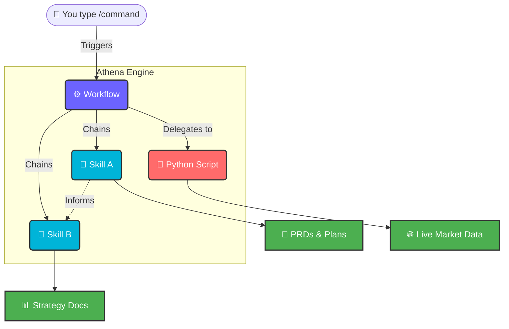

<div align="center">

# 🏛️ Athena

### The Intelligent Operating System for Product Excellence

[](https://github.com/phuryn/pm-skills/blob/main/LICENSE)
[](.)
[](.)
[](.)

*Athena transforms your Antigravity IDE into a world-class Product Management partner—embedding the wisdom of Teresa Torres, Marty Cagan, and Alberto Savoia directly into your daily workflow.*

---

</div>

## The Problem Athena Solves

Every Product Manager faces the same challenge: **the gap between knowing what to do and actually doing it well, consistently, at scale.**

You've read the books. You know about Opportunity Solution Trees, Lean Canvas, and Jobs-To-Be-Done. But when it's 4 PM on a Thursday and you need to write a PRD, design an experiment, or prepare a competitive battlecard for tomorrow's board meeting — you're starting from scratch. Every. Single. Time.

**Athena eliminates that gap.**

By embedding 65 deeply structured PM skills and 36 orchestrated workflows directly into your Antigravity IDE, Athena turns proven product frameworks into executable, repeatable processes. You don't just get advice — you get a guided, step-by-step co-pilot that asks the right questions, applies the right frameworks, and produces professional-grade deliverables in minutes.

The result isn't just faster work. **It's demonstrably better product decisions.**

---

## How Athena Works

Athena operates on three integrated layers, each purpose-built for the Antigravity ecosystem:



| Layer | Location | Purpose |
|:------|:---------|:--------|
| **🧠 Skills** | `.agents/skills/` | The knowledge base. Each skill encodes a specific PM framework (e.g., Teresa Torres' Assumption Mapping, Porter's Five Forces) as a structured markdown SOP. Athena loads the relevant skill automatically based on what the workflow requires. |
| **⚙️ Workflows** | `.agents/workflows/` | The orchestrators. User-triggered slash commands (e.g., `/discover`, `/strategy`) that chain multiple skills together into comprehensive, guided end-to-end processes with checkpoints and deliverables. |
| **🐍 Scripts** | `.agents/scripts/` | The deterministic backbone. When Athena needs live data—like scraping a competitor's pricing page—she delegates to real Python code (Playwright), ensuring your strategy is built on reality, not hallucinations. |

---

## Getting Started

**Prerequisites:** An active [Antigravity IDE](https://antigravity.dev) workspace with this repository cloned or opened as a project.

**Usage:** In any Antigravity conversation, simply type a slash command and press send:

```
/discover Smart notification system for our project management tool
```

Athena will guide you through a structured, multi-step workflow — asking clarifying questions, applying the right analytical frameworks, and producing professional deliverables you can immediately share with your team.

---

## Complete Workflow Reference

Below is the complete catalog of all 36 Athena workflows, organized by domain. Each workflow is a guided, multi-step process that chains together multiple underlying skills to produce comprehensive deliverables.

### 🔍 Product Discovery
*Navigate uncertainty with structural confidence. Move from divergent ideation to focused, validated experiments.*

| Command | What It Does |
|:--------|:-------------|
| `/discover` | Run a full product discovery cycle — from ideation through assumption mapping to experiment design. This is Athena's flagship workflow: a 15-30 minute structured sprint that produces a complete Discovery Plan with prioritized experiments and decision criteria. |
| `/brainstorm` | Brainstorm product ideas or experiments from PM, Designer, and Engineer perspectives — for existing or new products. Generates 10+ ideas with multi-lens rationale and lets you select which to carry forward. |
| `/triage-requests` | Analyze, categorize, and prioritize a batch of feature requests from customers or stakeholders. Transforms a messy backlog of requests into a structured, scored, and actionable priority list. |
| `/interview` | Prepare a customer interview script or summarize an interview transcript into structured insights. Supports both pre-interview preparation (generating question flows) and post-interview synthesis (extracting themes, quotes, and opportunities). |
| `/setup-metrics` | Design a product metrics dashboard with North Star metric, input metrics, health metrics, and alert thresholds. Produces a complete measurement framework ready for implementation. |

---

### ♟️ Product Strategy
*Move from reactive feature-building to proactive market leadership. Define where to play and how to win.*

| Command | What It Does |
|:--------|:-------------|
| `/strategy` | Create a comprehensive product strategy using the 9-section Strategy Canvas — from vision to defensibility. Covers market context, target customer, value proposition, competitive moat, key metrics, and strategic bets. |
| `/business-model` | Explore business models using Lean Canvas, Business Model Canvas, Startup Canvas, or Value Proposition frameworks. Athena asks which canvas you prefer and walks you through each section methodically. |
| `/value-proposition` | Design a value proposition using the 6-part JTBD template — Who, Why, What before, How, What after, Alternatives. Produces a crystal-clear articulation of your product's reason to exist. |
| `/market-scan` | Comprehensive macro environment analysis — SWOT, PESTLE, Porter's Five Forces, and Ansoff Matrix in one scan. Delivers a 360° view of your competitive landscape and strategic options. |
| `/pricing` | Design a pricing strategy — models, competitive analysis, willingness-to-pay estimation, and pricing experiments. Covers freemium, tiered, usage-based, and enterprise models with recommended test designs. |

---

### ⚙️ Execution
*Turn strategy into shipped product. The largest domain, covering the full build-measure-learn cycle.*

| Command | What It Does |
|:--------|:-------------|
| `/write-prd` | Create a comprehensive Product Requirements Document from a feature idea or problem statement. Produces a structured PRD with problem definition, user stories, success metrics, technical considerations, and launch criteria. |
| `/plan-okrs` | Brainstorm team-level OKRs aligned with company objectives — qualitative objectives with measurable key results. Ensures each Key Result is specific, time-bound, and has a clear owner. |
| `/transform-roadmap` | Convert a feature-based roadmap into an outcome-focused roadmap that communicates strategic intent. Transforms "build X, build Y" into "achieve outcome A, validate hypothesis B." |
| `/sprint` | Sprint lifecycle — plan a sprint, run a retrospective, or generate release notes. A versatile workflow that adapts to whichever phase of the sprint you're in. |
| `/pre-mortem` | Run a pre-mortem risk analysis on a PRD, launch plan, or feature — identify what could go wrong before it does. Surfaces blind spots across technical, market, organizational, and user dimensions. |
| `/meeting-notes` | Summarize a meeting transcript into structured notes with decisions, action items, and follow-ups. Paste in a transcript and receive clean, shareable notes in seconds. |
| `/stakeholder-map` | Map stakeholders on a Power × Interest grid and create a tailored communication plan. Identifies who needs to be managed closely, kept informed, or simply monitored. |
| `/write-stories` | Break a feature into backlog items — user stories, job stories, or WWA format with acceptance criteria. Produces dev-ready tickets with clear definitions of done. |
| `/test-scenarios` | Generate comprehensive test scenarios from user stories or feature specs — happy paths, edge cases, and error handling. Ensures nothing slips through QA. |
| `/generate-data` | Generate realistic dummy datasets for testing — CSV, JSON, SQL inserts, or Python scripts. Produces synthetic data that mirrors real-world patterns for prototyping and demos. |

---

### 🔬 Market Research
*Know your customer deeply. Combine qualitative insights with live, scraped competitive data.*

| Command | What It Does |
|:--------|:-------------|
| `/research-users` | Comprehensive user research — build personas, segment users, and map the customer journey from research data. Produces detailed persona cards, segmentation matrices, and end-to-end journey maps. |
| `/competitive-analysis` | Analyze the competitive landscape — identify competitors, compare strengths and weaknesses, find differentiation opportunities. **Enhanced with Playwright:** Athena can automatically scrape competitor websites for live pricing, feature lists, and positioning data before generating the analysis. |
| `/analyze-feedback` | Analyze user feedback at scale — sentiment analysis, theme extraction, and segment-level insights. Paste in NPS responses, support tickets, or survey data and receive structured, actionable themes. |

---

### 📈 Data Analytics
*Find the signal in the noise. Turn raw data into clear product decisions.*

| Command | What It Does |
|:--------|:-------------|
| `/write-query` | Generate SQL queries from natural language — supports BigQuery, PostgreSQL, MySQL, and more. Describe what you need in plain English and receive production-ready SQL with explanations. |
| `/analyze-cohorts` | Perform cohort analysis on user data — retention curves, feature adoption, and engagement trends. Structures your analysis around time-based cohorts with clear visualization recommendations. |
| `/analyze-test` | Analyze A/B test results — statistical significance, sample size validation, and ship/extend/stop recommendations. Provides a clear, defensible recommendation backed by the numbers. |

---

### 🎯 Go-To-Market
*Win the launch. From identifying the beachhead to engineering sustainable growth loops.*

| Command | What It Does |
|:--------|:-------------|
| `/plan-launch` | Create a full go-to-market strategy — beachhead segment, ICP, messaging, channels, and launch plan. A comprehensive GTM playbook from market entry to scale. |
| `/growth-strategy` | Design sustainable growth mechanisms — growth loops and GTM motions for product-led and sales-led strategies. Maps viral, content, paid, and sales-assisted loops with metrics for each. |
| `/battlecard` | Create a sales-ready competitive battlecard — positioning, feature comparison, objection handling, and win strategies. Produces a one-page reference your sales team can use in live deals. |

---

### 🌱 Marketing & Growth
*Accelerate the funnel. From naming to positioning to North Star alignment.*

| Command | What It Does |
|:--------|:-------------|
| `/market-product` | Brainstorm marketing ideas, positioning, value prop statements, and product names — creative marketing toolkit. A divergent brainstorming session across multiple creative dimensions. |
| `/north-star` | Define your North Star Metric and supporting input metrics — classify the business game and validate against best practices. Ensures your entire organization is aligned around the metric that matters most. |

---

### 🛠️ PM Toolkit
*The utility belt. Practical tools for the everyday demands of a Product Manager's career.*

| Command | What It Does |
|:--------|:-------------|
| `/review-resume` | Comprehensive PM resume review against 10 best practices — structure, impact metrics, keywords, and actionable feedback. Get senior-level resume coaching on demand. |
| `/tailor-resume` | Tailor a PM resume to a specific job description — keyword alignment, experience reframing, and strategic optimization. Maximizes your match score for ATS and human reviewers. |
| `/draft-nda` | Draft a Non-Disclosure Agreement between two parties with jurisdiction-appropriate clauses. Produces a professional legal document ready for review. |
| `/privacy-policy` | Draft a privacy policy covering data collection, usage, storage, and compliance requirements. Covers GDPR, CCPA, and other major frameworks. |
| `/proofread` | Check grammar, logic, and flow in any text — targeted fixes without rewriting. Surgical precision editing that preserves your voice while eliminating errors. |

---

## The Heritage & Methodology

Athena does not reinvent the wheel — she automates the best wheels ever built.

The skills and frameworks within Athena are rigorously grounded in the methodologies of the product management discipline's most respected voices:

| Author | Key Work | How Athena Uses It |
|:-------|:---------|:-------------------|
| **Teresa Torres** | *Continuous Discovery Habits* | Opportunity Solution Trees, assumption mapping, experiment design |
| **Marty Cagan** | *INSPIRED* & *TRANSFORMED* | Product team empowerment, discovery vs. delivery, product vision |
| **Alberto Savoia** | *The Right It* | Pretotyping, XYZ hypotheses, validation before building |
| **Dan Olsen** | *The Lean Product Playbook* | Product-market fit process, MVP hierarchy, UX optimization |
| **Ash Maurya** | *Running Lean* | Lean Canvas, riskiest assumption testing, pivot triggers |

> **A Homage to the Originals:**
> The foundational blueprints for these skills were masterfully curated and originally conceptualized by **Paweł Huryn** through [The Product Compass Newsletter](https://www.productcompass.pm/p/claude-skills). Athena stands on the shoulders of giants to bring you unparalleled AI-powered product acceleration.

---

## Technical Architecture

For a deep dive into Athena's engineering decisions — including Context Engineering principles, Harness Engineering patterns, and the Playwright-based competitive scraper — see the [ARCHITECTURE.md](./ARCHITECTURE.md) document.

---

<div align="center">

  *Empower your IDE. Engineer better outcomes. Ship products that matter.*

  **Built for [Antigravity](https://antigravity.dev) · Powered by PM Wisdom · Open Source**

</div>
